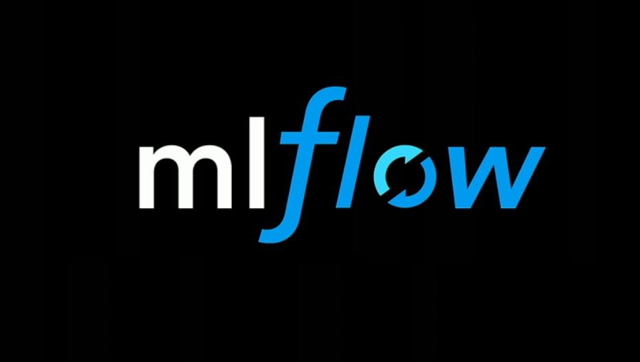

# mlflow_demo

## Goal: to learn the basics of MLflow

<!--
*** Thanks for checking out this README Template. If you have a suggestion that would
*** make this better, please fork the repo and create a pull request or simply open
*** an issue with the tag "enhancement".
*** Thanks again! Now go create something AMAZING! :D
***
***
***
*** To avoid retyping too much info. Do a search and replace for the following:
*** github_username, repo, twitter_handle, email
-->


<!-- PROJECT SHIELDS -->
<!--
*** I'm using markdown "reference style" links for readability.
*** Reference links are enclosed in brackets [ ] instead of parentheses ( ).
*** See the bottom of this document for the declaration of the reference variables
*** for contributors-url, forks-url, etc. This is an optional, concise syntax you may use.
*** https://www.markdownguide.org/basic-syntax/#reference-style-links
-->
[![Issues][issues-shield]][issues-url]
[![MIT License][license-shield]][license-url]
[![LinkedIn][linkedin-shield]][https://www.linkedin.com/in/samuel-mcguire/]


<!-- PROJECT LOGO -->
<br />
<p align="center">
  <a href="https://github.com/github_username/repo">
    
  </a>

  <h3 align="center">Machine Learning Lifecycle and MLflow basics</h3>

  <p align="center">
    YOUR_SHORT_DESCRIPTION
    <br />
    <a href="https://github.com/SamuelAdamsMcGuire/mlflow_demo"><strong>Explore the docs »</strong></a>
    <br />
    <br />
    <a href="https://github.com/SamuelAdamsMcGuire/mlflow_demo">View Demo</a>
    ·
    <a href="https://github.com/SamuelAdamsMcGuire/mlflow_demo/issues">Report Bug</a>
    ·
  </p>
</p>


<!-- TABLE OF CONTENTS -->
## Table of Contents

* [About the Project](#about-the-project)
  * [Built With](#built-with)
* [Getting Started](#getting-started)
  * [Prerequisites](#prerequisites)
  * [Installation](#installation)
* [Usage](#usage)
* [License](#license)
* [Contact](#contact)
* [Acknowledgements](#acknowledgements)


<!-- ABOUT THE PROJECT -->
## About The Project

Using the open source software MLflow to track and log machine learning models, their paramters, metrics and more!


<!-- GETTING STARTED -->
## Getting Started

To get a local copy up and running follow these simple steps.

### Prerequisites

Best would be to make a conda envrionment then install, sklearn, mlfow and jupyter notebook
```sh
conda install -c conda-forge mlflow 
```

### Installation
 
1. Clone the repo
```sh
git clone https://github.com/SamuelAdamsMcGuire/mlflow_demo.git
```
2. Install mentioned packages
```sh
conda install
```


<!-- USAGE EXAMPLES -->
## Usage
<p>
Open the wine_quality.ipynb notebook in jupyter notebooks. Follow the instructions. The notebook takes you through the process of reading data for the chemical feaures of wine and thier respective quality. The quality is what we are trying to predict. You will train a LR model while you log and track the model with MLflow. 
</p>
<p>
Then you will use the MLflow user interface to compare models, filter models, register models and then also call on models to make predictions. The train.py and train.ipynb are directly taken from the MLflow tutorial documentation and can be used to do work with the project as well.
</p>


<!-- LICENSE -->
## License

Distributed under the MIT License. See `LICENSE` for more information.


<!-- CONTACT -->
## Contact

Samuel Adams McGuire - email - samuelmcguire@engineer.com

Project Link: [https://github.com/SamuelAdamsMcGuire/mlflow_demo](https://github.com/SamuelAdamsMcGuire/mlflow_demo)


<!-- ACKNOWLEDGEMENTS -->
## Acknowledgements

* [Zoltal C. Toth CTO at Datapao](https://www.linkedin.com/in/zoltanctoth/)
* [ Szilard Pafka Chied Data Scientist at EP0CH](https://www.linkedin.com/in/szilard/)
* [MLflow](https://mlflow.org/)


<!-- MARKDOWN LINKS & IMAGES -->
<!-- https://www.markdownguide.org/basic-syntax/#reference-style-links -->
[contributors-shield]: https://img.shields.io/github/contributors/othneildrew/Best-README-Template.svg?style=flat-square
[contributors-url]: https://github.com/othneildrew/Best-README-Template/graphs/contributors
[forks-shield]: https://img.shields.io/github/forks/othneildrew/Best-README-Template.svg?style=flat-square
[forks-url]: https://github.com/othneildrew/Best-README-Template/network/members
[stars-shield]: https://img.shields.io/github/stars/othneildrew/Best-README-Template.svg?style=flat-square
[stars-url]: https://github.com/othneildrew/Best-README-Template/stargazers
[issues-shield]: https://img.shields.io/github/issues/othneildrew/Best-README-Template.svg?style=flat-square
[issues-url]: https://github.com/othneildrew/Best-README-Template/issues
[license-shield]: https://img.shields.io/github/license/othneildrew/Best-README-Template.svg?style=flat-square
[license-url]: https://github.com/othneildrew/Best-README-Template/blob/master/LICENSE.txt
[linkedin-shield]: https://img.shields.io/badge/-LinkedIn-black.svg?style=flat-square&logo=linkedin&colorB=555
[linkedin-url]: https://linkedin.com/in/othneildrew
[product-screenshot]: images/screenshot.png
